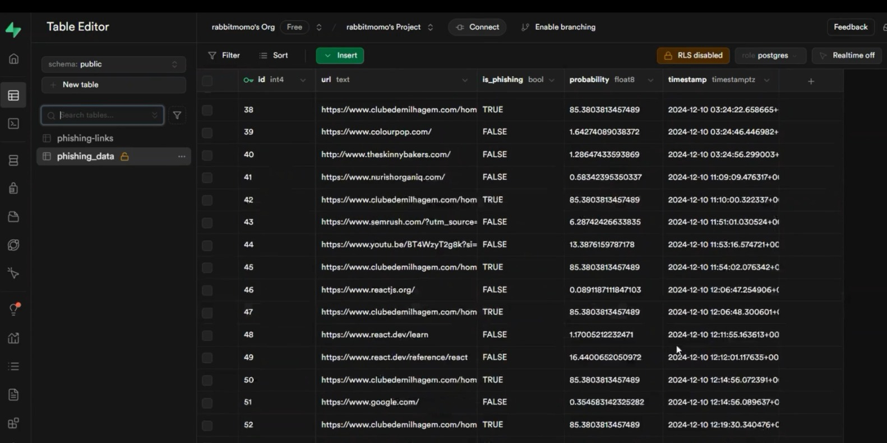

# GuardX-Server Backend API (ML Model, OpenAI Model, Database)

GuardX is a robust AI-powered phishing detection that utilizes ONNX machine learning models, Supabase database, and OpenAI Artificial Intelligence Model for advanced phishing website detection and analysis.

# Features

1. Phishing Detection: Detects malicious URLs using an ONNX ML model.

2. AI Analysis: Leverages OpenAI's GPT-3.5 Turbo for intelligent queries and threat analysis.

3. Supabase Integration: Securely stores phishing data in a cloud database for analysis.

4. RESTful Endpoints: Offers easy-to-use APIs for detection, data addition, and retrieval.

5. Real-Time Performance: Protects users instantly by analyzing threats in real-time.

# Backend Technology Stack Highlight

1. We have ONNX model which is trained Machine Learning Model to detect the phishing website
    a. it is named as model.onnx

2. We have configured the setting of Supabase database 
    a. Here is the screenshot of analyzing result
    

3. We have used the OpenAI Artificial Intelligence Model for analyzing the website

4. We have REFTFUL API that allow you to call the request easily from your project to our server and get the response immediately.

    a. Our heroku server website is https://phishing-detection-server-175f2c296ec7.herokuapp.com
    

    b. For example you may use the following code to get the response data from our server

    const response = await fetch('https://phishing-detection-server-175f2c296ec7.herokuapp.com/detect-phishing', {
            method: 'POST',
            headers: {
                'Content-Type': 'application/json'
            },
            body: JSON.stringify({ url: url })
    });

# To setup this server on your own local machine

1. Clone this folder

2. Add the .env file into the folder

3. Add these three environment variables into .env file
    a. SUPABASE_URL
    b._SUPABASE_KEY
    c.OPENAI_API_KEY

4. You may also import the private key from your supabase for the usage

5. Create a Procfile for heroku server and configure all the setting to host the server on heroku. Alternatively, you may use command of 
    a. npm install
    b. node server.js
to host the server on your local machine. But this is not recommend as it affect the usage of GuardX.

# GuardX-Server
